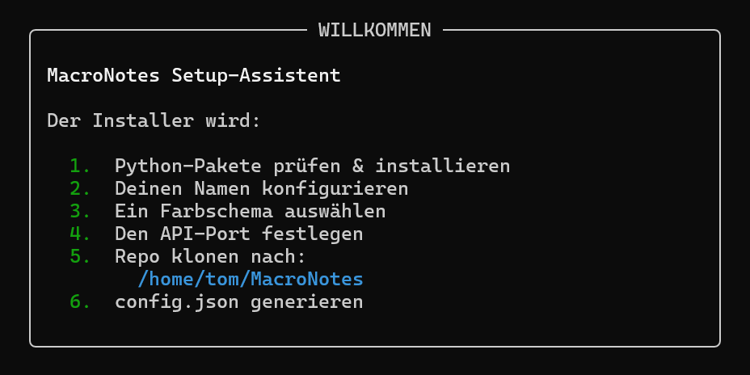

# MacroNotes Installer



Der **MacroNotes Installer** richtet MacroNotes automatisch ein, klont das Repository und erstellt die Konfiguration.

## Voraussetzungen

* Python 3
* Git
* Internetverbindung

## Installation

```bash
git clone https://github.com/BobBobinson007/mn-installer.git && cd mn-installer && python installer.py
```

## Ablauf

* Git wird geprüft
* Benötigte Python-Pakete werden installiert
* Name, Design und Port werden abgefragt
* Repository wird nach `~/MacroNotes` geklont
* `config.json` wird erstellt

## Konfigurationsdatei

Beispiel:

```json
{
    "name": "User",
    "design": {
        "name": "Standard",
        "color_name": "White",
        "color_code": "\u001b[37m",
        "highlight_code": "\u001b[1m"
    },
    "api_port": 8080
}
```

## Repository

https://github.com/BobBobinson007/mn-installer
